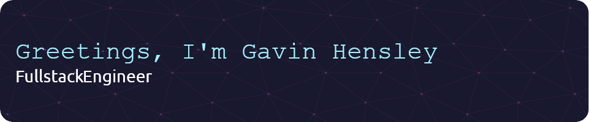

---

## 🚀 What I Do

- Build responsive, high-performance websites and web apps with modern frameworks.
- Develop full stack solutions, from elegant frontends to robust backends and **APIs**.
- Design visually appealing interfaces utilizing tools like **Figma** and **Adobe Illustrator**.
- Collaborate with others to build secure user-centric solutions.

---

## 🔧 Tools & Technologies

### Front-End Development

  
  
  
  
  
  
  
  

### Back-End Development

  
  
  
  
  
  

### Databases

  
  
  

### Tools & Miscellaneous

  
  
  
  
  
  

---

## 🖥️ Language Statistics

---

## 📜 Certifications

  
  
  
  
  
  

---

## 🔗 Connect with Me

- [LinkedIn](https://www.linkedin.com/in/g-hensley)
- [Portfolio](https://gavin-hensley.tech)

---

## 🚀 Fun Facts

- I built my portfolio site from scratch! 💻
- I taught myself Java in less than a week! ☕
- When I'm not coding, you can find me exploring the outdoors, reading, or working on side projects. 🌱

---

## 👀 Profile Visitors

---
Thanks for visiting my profile! Let's build something amazing together! 🌍✨
