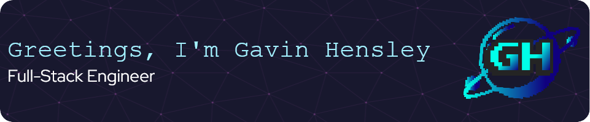

  

---

<b>Full-Stack Software Engineer | 4+ years of development experience | B.S. Software Engineering</b>

  

  👨‍💻 <b>Product Engineer at <a target="_blank" href="https://apisec.ai">APIsec</a></b> — Building API security solutions and handling 77% of customer integrations  
  🚀 <b>Founder of <a target="_blank" href="https://codaissance.com">Codaissance</a></b> — Building SaaS products in public with React, Next.js, and TypeScript  
  🛡️ <b>Co-Founder of <a target="_blank" href="https://tampertantrumlabs.com">TamperTantrum Labs</a></b> — Making application security accessible for solo devs and startups  
  🎯 <b>What I do:</b> Build fast, accessible, secure web applications. I care about clean architecture, great UX, and shipping products that actually help people.
  

---

<h2 align='center'>💼 Featured Projects </h2>

| Project | Description | Tech Stack |
|--------|-------------|------------|
| [🧠 MindTrace](https://github.com/G-Hensley/mindtrace) | Full-stack MVP for tracking student behavior logs with auth, CRUD, and report generation. 25+ unit tests, >95 Lighthouse scores. | Next.js, TypeScript, Supabase, Vitest, Turborepo |
| [🌐 BuiltInPublic](https://github.com/Christin-paige/BuiltInPublic) | Social platform for devs to share their coding journey. Co-led backend, built 60% of UI components, improved load times 35%. | Next.js, TypeScript, Supabase, Docker, CI/CD |
| [🎨 Portfolio](https://gavinhensley.dev) | Custom portfolio with AWS S3 file uploads, admin dashboard, and CI/CD. Modernized 3+ legacy projects, cut load times 30%. | React, TypeScript, Node.js, AWS S3, MongoDB |
| [🛡️ TamperTantrum Labs](https://tampertantrumlabs.com) | Application security consulting website with products coming soon! | React, Node.js, Express, MongoDB |
| [💰 Expense Tracker](https://github.com/G-Hensley/expense-tracker) | Full-stack expense tracking with GraphQL API. Designed for 500+ users, <2s load times, 45% reduction in data transfer. | Next.js, GraphQL, MongoDB, Vercel |

---

<h2 align="center">🔧 Tools & Technologies</h2>

<table align="center">
  <tr>
    <th>🌐 Front-End</th>
    <th>🔧 Back-End</th>
  </tr>
  <tr>
    <td>
       
       
       
       
       
       
       
      
    </td>
    <td>
       
       
       
       
       
      
    </td>
  </tr>
</table>

<table align="center">
  <tr>
    <th>🛢️ Databases</th>
    <th>🛠️ Tools & DevOps</th>
  </tr>
  <tr>
    <td>
       
       
       
      
    </td>
    <td>
       
       
       
       
       
      
    </td>
  </tr>
</table>

---

<h2 align='center'>📜 Certifications</h2>

  
  
  
  
  
  
  
  

---

<h2 align='center'>🌐 Connect with Me</h2>

  
  
  

---

## 🎯 2026 Goals & Mission

- 🚀 Launch first revenue-generating SaaS product through Codaissance.
- 💰 Build recurring revenue stream to supplement employment income.
- 🌐 Contribute meaningfully to 3+ open-source projects.
- 📜 Earn AWS Solutions Architect Associate certification.
- 🧪 Achieve 80%+ test coverage across all active projects.
- 🐋 Deploy production apps with Docker + CI/CD pipelines.
- ✍️ Publish technical blog posts on personal site.
- 🤝 Grow professional network to 5,000+ LinkedIn connections.

---

## 🎉 Fun Facts

- 🏫 Finished my B.S. in Software Engineering in under 6 months
- 🤖 Built a "Personal OS" repo with 10+ GitHub Actions automating my career (job search, resume generation, LinkedIn posts)
- 🧪 I actually enjoy writing tests — Vitest is my jam
- ♟️ Chess player... mostly against bots, but I'm improving
- 🌲 When not coding, I'm probably outside touching grass

---

## 🔥 GitHub Streak

---

  <h2>🐍 Contribution Snake</h2>

  <picture>
    <source media="(prefers-color-scheme: dark)" srcset="https://raw.githubusercontent.com/G-Hensley/G-Hensley/output/github-snake-dark.svg" />
    <source media="(prefers-color-scheme: light)" srcset="https://raw.githubusercontent.com/G-Hensley/G-Hensley/output/github-snake.svg" />
    
  </picture>

---

  <b>Thanks for stopping by! 😄👋</b>  
   🚀 Let’s build something amazing together 🚀

